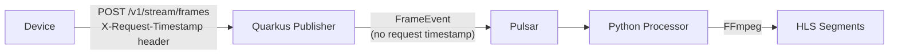

# Frame Timestamp Watermark Feature - Progress Document

## Overview

This document tracks the implementation of per-frame timestamp watermarks for video streams. The feature adds visual timestamp overlays to each frame showing when the frame was received by the HTTP publisher, enabling users to see precise timing information in the video playback.

## Scope

### Feature Requirements

1. **Timestamp Source**: Display the HTTP request timestamp (`X-Request-Timestamp` header) from when the frame was received by the publisher
2. **Watermark Position**: Top-right corner of each frame (configurable)
3. **Implementation Method**: Per-frame image modification using Pillow before FFmpeg processing
4. **Configuration**: Feature is opt-in via environment variables (disabled by default)

### Cross-Repository Work

This feature requires changes in two repositories:

1. **Publisher Repository** (`quarkus-http-pulsar-publisher`)
   - Pass request timestamp through Pulsar events
   - Foundation for downstream watermarking

2. **Processor Repository** (`python-stream-processor`)
   - Consume request timestamp from events
   - Apply watermarks to frames
   - Main feature implementation

## GitHub Issues and Branches

| Repository | Issue | Branch | Status |
|------------|-------|--------|--------|
| `microboxlabs/quarkus-http-pulsar-publisher` | [#15](https://github.com/microboxlabs/quarkus-http-pulsar-publisher/issues/15) | `based/15-add-request-timestamp` | Ready for development |
| `microboxlabs/python-stream-processor` | [#8](https://github.com/microboxlabs/python-stream-processor/issues/8) | `based/8-frame-watermark` | Ready for development |

## Current Architecture



**Current Limitation**: The HTTP request timestamp (`X-Request-Timestamp`) is received by the publisher but not included in the Pulsar event payload.

## Target Architecture


## Implementation Plan

### Phase 1: Publisher Changes (Issue #15)

**Repository**: `microboxlabs/quarkus-http-pulsar-publisher`  
**Branch**: `based/15-add-request-timestamp`

#### Tasks

1. **Update EventPublisher Interface**
   - File: `src/main/java/cl/streamhub/stream/service/EventPublisher.java`
   - Add `Long requestTimestamp` parameter to `publishStreamFrame()` method

2. **Update PulsarStreamEventPublisher Implementation**
   - File: `src/main/java/cl/streamhub/stream/service/impl/PulsarStreamEventPublisher.java`
   - Include `requestTimestamp` field in JSON message payload
   - Value: Unix epoch seconds (Long type)

3. **Update StreamFrameResource**
   - File: `src/main/java/cl/streamhub/stream/StreamFrameResource.java`
   - Pass `requestTime.getEpochSecond()` to `publishStreamFrame()` call
   - Location: Line ~280-289 in `ingestFrames()` method

#### Event Schema Change

**Before**:
```json
{
  "eventId": "...",
  "clientId": "...",
  "deviceId": "...",
  "timestamp": "2024-01-15T10:30:00Z",
  "framePath": "...",
  "requestId": "..."
}
```

**After**:
```json
{
  "eventId": "...",
  "clientId": "...",
  "deviceId": "...",
  "timestamp": "2024-01-15T10:30:00Z",
  "requestTimestamp": 1705315800,
  "framePath": "...",
  "requestId": "..."
}
```

#### Acceptance Criteria

- [ ] `requestTimestamp` field included in all Pulsar frame events
- [ ] Value is Unix epoch seconds (Long type)
- [ ] Graceful fallback if `X-Request-Timestamp` header not provided (uses current time)
- [ ] Backward compatible (field is optional for consumers)

---

### Phase 2: Processor Changes (Issue #8)

**Repository**: `microboxlabs/python-stream-processor`  
**Branch**: `based/8-frame-watermark`

#### Tasks

1. **Update Event Model**
   - File: `src/stream_processor/model/events.py`
   - Add `request_timestamp: datetime | None` field to `FrameEvent`
   - Use alias `requestTimestamp` for JSON parsing
   - Handle Unix epoch seconds conversion

2. **Add Watermark Configuration**
   - File: `src/stream_processor/config/settings.py`
   - Create `WatermarkConfig` class with:
     - `enabled: bool` (default: False)
     - `position: str` (default: "top_right")
     - `font_size: int` (default: 24)
     - `format: str` (default: "%Y-%m-%d %H:%M:%S.%f")
   - Add `watermark: WatermarkConfig` to `Settings` class

3. **Create Watermark Service**
   - File: `src/stream_processor/service/watermark_service.py` (NEW)
   - Implement `WatermarkService` class:
     - `add_timestamp_watermark()` method
     - Uses Pillow (PIL) for image manipulation
     - Draws timestamp text with semi-transparent background
     - Positions text in top-right corner with padding
     - Saves watermarked frame (overwrites original or creates new path)

4. **Integrate into Consumer**
   - File: `src/stream_processor/consumer/pulsar_consumer.py`
   - Modify `_process_frame()` method:
     - Check if watermark enabled and `request_timestamp` present
     - Apply watermark before adding frame to pending frames
     - Use async/await for non-blocking processing

5. **Add Dependencies**
   - File: `pyproject.toml`
   - Add `Pillow>=10.0.0` to dependencies

#### Watermark Service Implementation Details

- **Library**: Pillow (PIL) for image processing
- **Text Format**: `YYYY-MM-DD HH:MM:SS.mmm` (configurable)
- **Position**: Top-right corner with 10px padding
- **Styling**:
  - White text color
  - Semi-transparent black background (80% opacity)
  - Default font size: 24px (configurable)
  - Font: System default monospace font
- **Output**: Overwrites original frame or saves to new path

#### Acceptance Criteria

- [ ] Watermark service creates readable timestamp overlay
- [ ] Timestamp uses `request_timestamp` from event (falls back to `timestamp` if not available)
- [ ] Position is configurable (top_right default)
- [ ] Feature is disabled by default (opt-in via `WATERMARK_ENABLED`)
- [ ] Semi-transparent background for readability on varied frame content
- [ ] No significant performance degradation (async processing)
- [ ] Handles both local filesystem and GCS frame paths

---

## Environment Variables

### Processor Configuration

| Variable | Default | Description |
|----------|---------|-------------|
| `WATERMARK_ENABLED` | `false` | Enable timestamp watermarking |
| `WATERMARK_POSITION` | `top_right` | Position: `top_right`, `top_left`, `bottom_right`, `bottom_left` |
| `WATERMARK_FONT_SIZE` | `24` | Font size in pixels |
| `WATERMARK_FORMAT` | `%Y-%m-%d %H:%M:%S.%f` | Python strftime format string |

## Files to Modify

### Publisher Repository
- `src/main/java/cl/streamhub/stream/service/EventPublisher.java`
- `src/main/java/cl/streamhub/stream/service/impl/PulsarStreamEventPublisher.java`
- `src/main/java/cl/streamhub/stream/StreamFrameResource.java`

### Processor Repository
- `src/stream_processor/model/events.py`
- `src/stream_processor/config/settings.py`
- `src/stream_processor/consumer/pulsar_consumer.py`
- `pyproject.toml`

## Files to Create

### Processor Repository
- `src/stream_processor/service/watermark_service.py`

## Implementation Order

1. **Phase 1 (Publisher)** must be completed first
   - Processor depends on `requestTimestamp` field in events
   - Can be tested independently

2. **Phase 2 (Processor)** follows Phase 1
   - Requires updated event schema from Phase 1
   - Can be developed in parallel but not deployed until Phase 1 is merged

## Testing Strategy

### Publisher Testing
- Unit tests for `PulsarStreamEventPublisher`
- Verify `requestTimestamp` field in JSON payload
- Test fallback behavior when header missing

### Processor Testing
- Unit tests for `WatermarkService`
- Test timestamp formatting and positioning
- Integration tests with sample frames
- Performance testing for watermark overhead
- Test with both filesystem and GCS storage backends

## Dependencies

- **Publisher**: No new dependencies
- **Processor**: 
  - `Pillow>=10.0.0` (new dependency)

## Risks and Mitigations

| Risk | Impact | Mitigation |
|------|--------|------------|
| Performance degradation from image processing | High | Use async processing, optimize Pillow operations, make feature opt-in |
| Watermark not readable on certain frame backgrounds | Medium | Use semi-transparent background, configurable styling |
| Backward compatibility with existing events | Low | Make `requestTimestamp` optional in event model |
| Storage path handling (GCS vs filesystem) | Medium | Test both backends, handle path conversion properly |

## Success Metrics

- [ ] Watermarks visible and readable in HLS playback
- [ ] Timestamp accuracy matches HTTP request time
- [ ] No significant increase in processing latency (< 5% overhead)
- [ ] Feature works with both storage backends (filesystem and GCS)
- [ ] Configuration is intuitive and well-documented

## Notes

- Feature is **opt-in** by default to avoid impacting existing deployments
- Watermarking happens **before** FFmpeg processing to ensure timestamps are embedded in the video
- Timestamp format is configurable to support different display preferences
- Position is configurable to avoid conflicts with other UI elements
